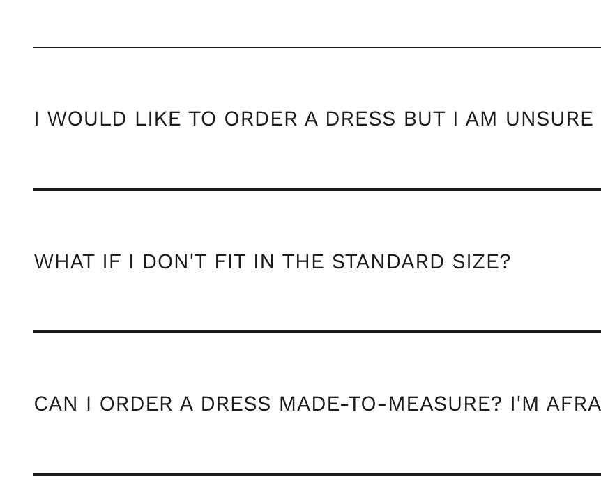

1. Shipped libraries include known security vulnerabilities, see Dojo 1.10.4.

2. It would be preferred for all external libraries with known fixed versions to set [subresource integrity](https://developer.mozilla.org/en-US/docs/Web/Security/Subresource_Integrity) and [content security policy](https://developer.mozilla.org/en-US/docs/Web/HTTP/CSP) if they can't be bundled. Some already have this, but not all.

3. The new collection background image is not sufficiently large, on any reasonably sized display the image will have low quality grain.


4. Ensure all images have `width` and `height` attributes set to avoid layout shifts as the page loads. This is already mostly done, but there are a few exceptions here and there.


5. The video player on the shop homepage keeps streaming endlessly, using up data even if the video is never in view. A good way to sidestep the issue on modern browsers is the [Intersection Observer API](https://developer.mozilla.org/en-US/docs/Web/API/Intersection_Observer_API). You can use the [YouTube IFrame API](https://developers.google.com/youtube/iframe_api_reference) to control the player.

6. The viewport definition unnecessarily limits zooming, this reduces usability for all users whose browsers don't override this.

Before:

```html
<meta name="viewport" content="width=device-width, initial-scale=1.0, height=device-height, minimum-scale=1.0, maximum-scale=1.0">
```

After:

```html
<meta name="viewport" content="width=device-width, initial-scale=1.0, height=device-height">
```

7. Some external links pass referrer and/or opener information, please specify `rel="noopener noreferrer"` for external links where this is not intentionally kept intact for tracking.

Before:

```html
<a href="..." target="_blank">...</a>
```

After:

```html
<a href="..." target="_blank" rel="noopener noreferrer">...</a>
```

8. Tab navigation is partially broken. On the shop home page, certain carousel elements etc can be focused which have no interactivity nor accessible label so the user will have no information what's going on.


10. Tab navigating through product carousels breaks them.


11. It would be preferable to hide the social media icon SVG from the accessibility tree since they already have a label set.


Before:

```html
<a href="https://www.facebook.com/lillijahilo" aria-label="Facebook" ...>
  <span class="Icon-Wrapper--clickable">
    <svg ... />
  </span>
</a>
```

After:

```html
<a href="https://www.facebook.com/lillijahilo" aria-label="Facebook" ...>
  <span class="Icon-Wrapper--clickable" aria-hidden>
    <svg ... />
  </span>
</a>
```

Or alternatively:

```html
<a href="https://www.facebook.com/lillijahilo" aria-label="Facebook" ...>
  <span class="Icon-Wrapper--clickable">
    <svg role="presentation" ... />
  </span>
</a>
```

12. Some button backgrounds break on different zoom levels. For example, the "Discover" button at 125% zoom:  


13. It would be preferable to set opacity on the icon SVG, rather than on the button element itself. This ensures that the element outline is always fully visible. Outline visibility is important as it's often used by people with poor eyesight.


14. Some text content has insufficient contrast to the background. In the below example, the contrast ratio is 2.84 while 4.5 is the minimum recommended value.


15. FAQ elements have inconsistent borders, the top border is one px while between the elements two one px borders are stacked.



16. Tab navigation is broken in product image galleries, the user can tab navigate to elements which they can not visibly interact with. Focus should be trapped to visible interactive elements.

17. Native scrolling is partially broken in product image galleries. Using the scroll bar with the mouse, the main page can be scrolled behind the open gallery.

18. No [`prefers-reduced-motion`](https://developer.mozilla.org/en-US/docs/Web/CSS/@media/prefers-reduced-motion) support is present, many animated elements can create discomfort or nausea for people with certain disabilities. All major OS-es and browsers have support for this, a basic implementation would be e.g.

```scss
@media (prefers-reduced-motion) {
  *,
  *:before,
  *:after {
    transition: none !important;
    animation-delay: 0ms !important;
    animation-duration: 0ms !important;
  }
}
```

19. News items use numerous links for the same article, it would be preferable to wrap the whole item in a link and style to match instead.  

Before:

```html
<article ...>
  <a ...>
    
  </a>
  <div ...>
    <h2 ...>
      <a ...>...</a>
    </h2>
    <p ...>
      <a ...>...</a>
    </p>
  </div>
</article>
```

After:

```html
<article ...>
  <a ...>
    
    <div ...>
      <h2 ...>...</h2>
      <p ...>...</p>
    </div>
  </a>
</article>
```


20. Leading news item with a bright background results in unreadable text.


